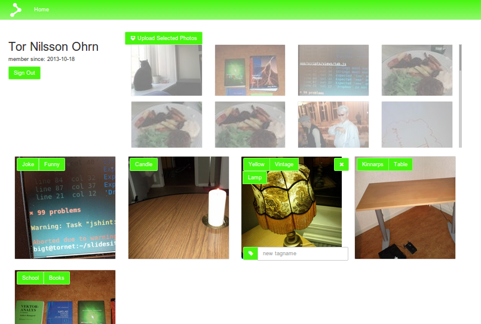

thingscloud
===========

Server side that feeds the Thingsbook client application with JSON data from a Neo4j database. 

Activity Diagram for authentication without the need for Thingscloud to store any user password:

Screenshot from the application:

